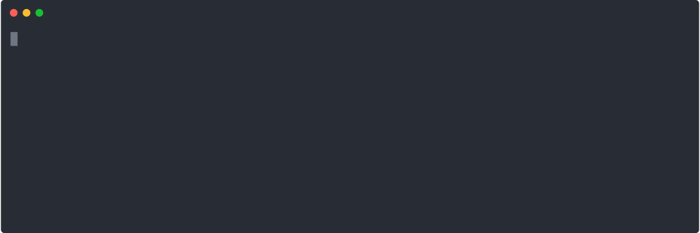
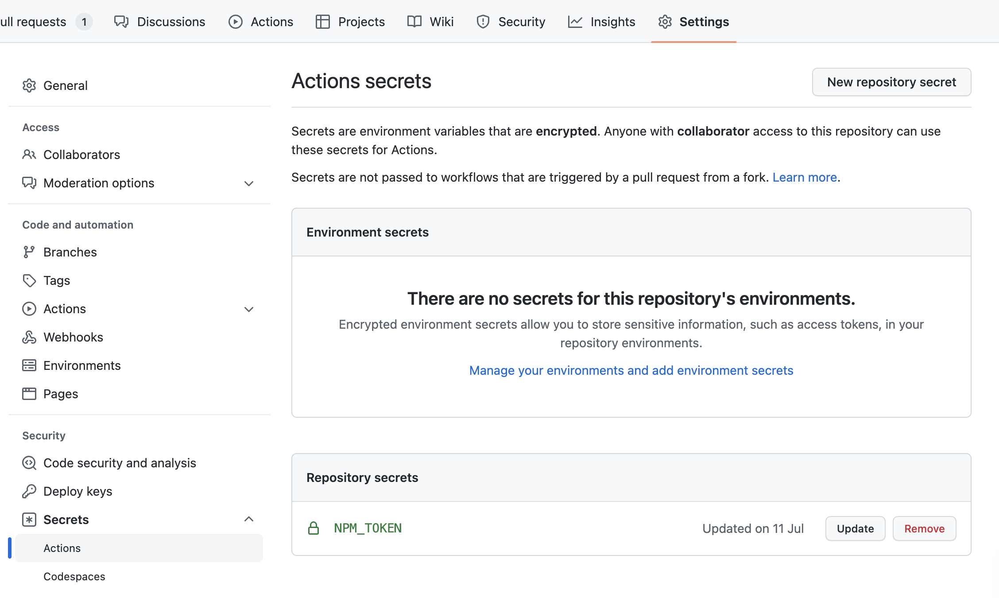
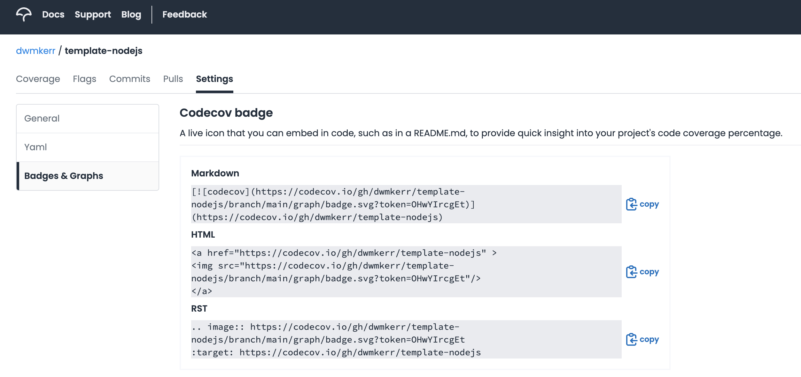

# template-nodejs-module

[](https://github.com/dwmkerr/template-nodejs/actions/workflows/release-please.yaml)
[](https://codecov.io/gh/dwmkerr/template-nodejs)
[](https://www.npmjs.com/package/@dwmkerr/template-nodejs-module)
[](#contributors)

A template for a Node.js module that has basic standards for linting, testing, build pipelines, NPM deployment, documentation and contributors. Contains rich documentation, and a [Template Guide](#template-guide) with instructions on how to customise for your own use.



<!-- vim-markdown-toc GFM -->

* [Template Quickstart](#template-quickstart)
* [Quickstart](#quickstart)
* [Developer Guide](#developer-guide)
    * [Local Setup](#local-setup)
    * [Linting the Code](#linting-the-code)
    * [Testing the Code](#testing-the-code)
    * [Git Hooks & Conventional Commits](#git-hooks--conventional-commits)
    * [Debugging](#debugging)
    * [Build Pipelines](#build-pipelines)
        * [Pull Request Pipeline](#pull-request-pipeline)
        * [Release Pipeline](#release-pipeline)
    * [Adding Contributors](#adding-contributors)
    * [Managing Releases](#managing-releases)
* [Contributors](#contributors)
* [Template Guide](#template-guide)
    * [Lint Configuration](#lint-configuration)
    * [Test Configuration](#test-configuration)
    * [Git Hooks](#git-hooks)
    * [Enabling Deploy to NPM](#enabling-deploy-to-npm)
    * [Enabling the Code Coverage Badge](#enabling-the-code-coverage-badge)
    * [All Contributors Configuration](#all-contributors-configuration)
    * [Recording a Demo and Embedding in the Readme](#recording-a-demo-and-embedding-in-the-readme)
    * [Testing the Rename Script](#testing-the-rename-script)
    * [Potential Improvements](#potential-improvements)

<!-- vim-markdown-toc -->

## Template Quickstart

ℹ️ **Note** this section of the documentation can be deleted when you have customised the project to your liking!

Clone the code to your machine, rename the template to match your GitHub username and provide a module name, then build and you are good to go!

```bash
git clone git@github.com:dwmkerr/template-nodejs-module
make rename-template # will ask you for your github username and project name
npm install
npm start
rm -rf ./scripts     # remove unneeded template scripts
```

Then follow the [Template Guide](#template-guide) for more instructions on how to customised the template to your needs. Once that's done, this quickstart section and the template guide section can be safely deleted from the README.

## Quickstart

Install this module with the following command:

```sh
npm install --save @dwmkerr/template-nodejs-module
```

Use in your code with:

```js
const templateNodeJsModule = require('@dwmkerr/template-nodejs-module');

// todo - add your code here.
```

## Developer Guide

The project has the following basic structure:

| Path           | Description                                                    |
|----------------|----------------------------------------------------------------|
| `index.js`     | Module entrypoint.                                             |
| `./artifacts/` | Artifacts generated during build (reports etc). Not committed. |
| `./docs/`      | Project documentation.                                         |
| `./lib/`       | Module source code.                                            |

All other local files are configuration for tools and so on. The following modules are also used:

| Module                                                               | Description                                 |
|----------------------------------------------------------------------|---------------------------------------------|
| **Runtime Dependencies**                                             |                                             |
| [`debug`](https://github.com/debug-js/debug)                         | Enable / configure debug output at runtime. |
| **Development Dependencies**                                         |                                             |
| [`commitlint`](https://github.com/conventional-changelog/commitlint) | Commit message formatting.                  |
| [`eslint`](https://github.com/eslint/eslint)                         | Linting and code style.                     |
| [`husky`](https://typicode.github.io/husky/#/)                       | Git Hook Management.                        |
| [`jest`](https://jestjs.io)                                          | Testing and code coverage.                  |
| **Additional Dependencies**                                          |                                             |
| [Codecov.io](https://codecov.io)                                     | Code coverage reporting for PRs and badges. |

### Local Setup

Ensure you have Node.js installed. [Node Version Manager](https://github.com/nvm-sh/nvm) is recommended. Use the latest Node Long-Term Support Version and install local dependencies with:

```bash
nvm use --lts
npm install
```

### Linting the Code

To lint, run:

```bash
npm run lint
```

To lint and auto-fix mistakes where possible, run:

```bash
npm run lint:fix
```

All changes are linted as part of the pre-commit hook.

### Testing the Code

Unit tests are in files adjacent to source files. For example, the tests for `./lib/hello-world.js` are in `./lib/hello-world.test.js`.

Run unit tests with:

```bash
npm test
```

You can set breakpoints in test code, or use the `debugger` statement to pause execution in a unit test to troubleshoot.

To run the test with the debugger enabled run:

```bash
npm run test:debug
```

### Git Hooks & Conventional Commits

[Husky](https://typicode.github.io/husky/#/) is used to simplify the management of Git Hooks. Hooks are stored in the [`.husky/`](./.husky) directory.

A pre-commit hook ensures the code lints and tests pass. A commit-message hook ensures that commits follow [Conventional Commits](https://conventionalcommits.org/) semantics. The commit message configuration is [`@commitlint/config-conventional`](https://github.com/conventional-changelog/commitlint/tree/master/%40commitlint/config-conventional) and is specified directly in the [`.husky/commit-msg`](./.husky/commit-msg) hook.

To commit without running hooks, use:

```bash
git commit --no-verify
```

### Debugging

This module use the [`debug`](https://github.com/debug-js/debug) library to make it simple to log or show extra debugging information. To enable debug output:

```bash
DEBUG=template-nodejs-module npm run
```

Or run:

```bash
npm run start:debug
```

To add debug output, use the example below:

```js
const debug = require('debug')('template-nodejs-module');

debug('Log debug output like this.');
```

### Build Pipelines

There are two pipelines that run for the project:

#### Pull Request Pipeline

Whenever a pull request is raised, the [Pull Request Workflow](./.github/workflows/pull-request.yaml) is run. This will:

- Install dependencies
- Lint
- Run Tests
- Upload Coverage

Each stage is run on all recent Node versions, except for the 'upload coverage' stage which only runs for the Node.js LTS version. When a pull request is merged to the `main` branch, if the changes trigger a new release, then [Release Please](https://github.com/google-github-actions/release-please-action) will open a Release Pull Request. When this request is merged, the [Release Pipeline](#release-pipeline) is run.

#### Release Pipeline

When a [Release Please](https://github.com/google-github-actions/release-please-action) pull request is merged to main, the [Release Please Workflow](./.github/workflows/release-please) is run. This will:

- Install dependencies
- Lint
- Run Tests
- Upload Coverage
- Deploy to NPM if the `NPM_TOKEN` secret is set

Each stage is run on all recent Node versions, except for the 'upload coverage' stage which only runs for the Node.js LTS version.

⚠️ note that the NPM Publish step sets the package to public - don't forget to change this if you have a private module.

### Adding Contributors

To add contributors, use a comment like the below in any pull request:

```
@all-contributors please add @<username> for docs, code, tests
```

More detailed documentation is available at:

https://allcontributors.org/docs/en/bot/usage


### Managing Releases

When changes to `main` are made, the Release Please stage of the pipeline will work out whether a new release should be generated (by checking if there are user facing changes) and also what the new version number should be (by checking the log of conventional commits). Once this is done, if a release is required, a new pull request is opened that will create the release.

Force a specific release version with this command:

```bash
version="0.1.0"
git commit --allow-empty -m "chore: release ${version}" -m "Release-As: ${version}"
```

## Contributors

<!-- ALL-CONTRIBUTORS-LIST:START - Do not remove or modify this section -->
<!-- prettier-ignore-start -->
<!-- markdownlint-disable -->
<table>
  <tbody>
    <tr>
      <td align="center"><a href="http://www.dwmkerr.com"><br /><sub><b>Dave Kerr</b></sub></a><br /><a href="https://github.com/dwmkerr/template-nodejs-module/commits?author=dwmkerr" title="Documentation">📖</a> <a href="https://github.com/dwmkerr/template-nodejs-module/commits?author=dwmkerr" title="Code">💻</a> <a href="#projectManagement-dwmkerr" title="Project Management">📆</a></td>
    </tr>
  </tbody>
  <tfoot>
    
  </tfoot>
</table>

<!-- markdownlint-restore -->
<!-- prettier-ignore-end -->

<!-- ALL-CONTRIBUTORS-LIST:END -->
<!-- prettier-ignore-start -->
<!-- markdownlint-disable -->

<!-- markdownlint-restore -->
<!-- prettier-ignore-end -->

<!-- ALL-CONTRIBUTORS-LIST:END -->

---

ℹ️ **Note** this section of the documentation can be deleted when you have customised the project to your liking!

## Template Guide

This section of the document covers how to use and adapt the code in this template. Once you have customised your project to meet your needs, you can safely delete it.

The design goals of this template are:

- Focus on essential hygiene needed in open source projects - pull request builds, contributions list, commit standards and so on
- Avoid being prescriptive with libraries - make it easy for users to swap out or remove

- Adding TypeScript support
- Changing the project name
- Adding a coverage badge

### Lint Configuration

Linting is handled by [`eslint`](https://eslint.org). You can create your own eslint configuration by running:

```bash
npm init @eslint/config
```

If you want to use another linter, just delete the `.eslintrc.yml` file and update the `package.json` with the appropriate libraries and lint commands.

### Test Configuration

Tests are run with [`jest`](https://jestjs.io/). The Jest configuration is currently in the [`package.json`](./package.json) file. If you extend this configuration, or want to use another test framework, you should put the test configuration into its own file.

### Git Hooks

[Husky](https://typicode.github.io/husky/#/) is used to simplify the management of Git Hooks. The current Git Hook setup is very basic:

- Pre Commit: Lint and run tests
- Commit Message: Check with [`commitlint`](https://github.com/conventional-changelog/commitlint)

If you want to uninstall Husky and remove the hooks, run:

```bashnpm uninstall husky && git config --unset core.hooksPath
npm uninstall husky && git config --unset core.hooksPath
git -rm .husky
```

### Enabling Deploy to NPM

To deploy to NPM when your project has a 'release please' pull request merged, simply add an `NODE_AUTH_TOKEN` secret variable to your [GitHub Actions](./settings/secrets/actions):



You can generate an NPM Auth token by following this guide:

https://docs.npmjs.com/creating-and-viewing-access-tokens

### Enabling the Code Coverage Badge

The code coverage badges are provided by [Codecov.io](https://codecov.io). To enable the for your project, log into htts://codecov.io using your GitHub account. Once any build pipeline has run for the project, there will be code coverage data and your project will be shown in the Codecov project list. Select your project, choose 'Settings > Badges' and update the markdown at the top of this file to use the badge code for your project:



Note that it _is_ possible to create a code coverage badge without resorting to a third party service, the details are at:

https://dev.to/thejaredwilcurt/coverage-badge-with-github-actions-finally-59fa

This could be considered if you want to avoid using external services. You could also vote for the Code Coverage Badges GitHub Feature.

### All Contributors Configuration

To enable [https://allcontributors.org] for your project, which allows you to keep track of contributors, install the All Contributors Bot by following the instructions below.

https://allcontributors.org/docs/en/bot/installation

To remove any 'All Contributors' configuration, just delete the 'Contributors' section of the README and the badge from the top of the file.

### Recording a Demo and Embedding in the Readme

The demo shown has been recorded using [`asciinema`](https://asciinema.org/) with the resulting cast converted to SVG with [`svg-term-cli`](https://github.com/marionebl/svg-term-cli).

To record your own demo, make sure `asciinema` is installed, then run:

```bash
asciinema rec ./docs/demo.cast # Hit Ctrl-D when you have finished recording...
npx svg-term-cli --in ./docs/demo.cast --out ./docs/demo.svg --window
```

### Testing the Rename Script

There is a basic test script that runs a Docker container, clones the repo, runs the rename script and then asserts that the project runs and shows the expected output. Run this test with:

```bash
cd ./scripts
./test-rename-module.sh
```

### Potential Improvements

Some improvements to this template that might be worth considering:

- Pull Request and Issue templates, in particular asking issue reporters to run with `DEBUG=template-nodejs-module` set
- Suggested steps for turning this into a CLI (e.g. quick start for something like Commander)
- Instructions on how to use [`pkg`](https://github.com/vercel/pkg) to build self-contained binaries
- Auto-reload node.js with webpack or nodemon or similar
- Steps required to convert to a TypeScript project
- Add the 'rename' function to the demo cast
